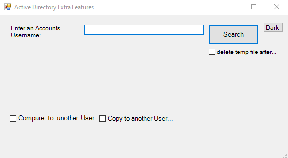
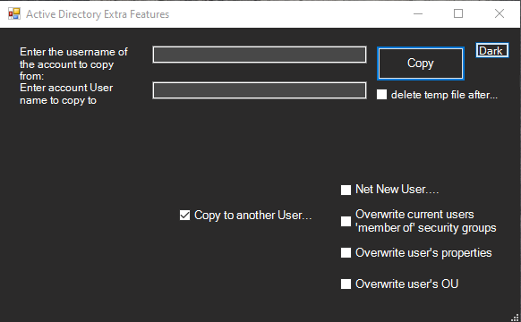

# Ad_HTML_Page
Active Directory HTML page.  
This program was made for the IT department at PRHC hospital as a tool to provide easy access to processes that are not available in Active Directory and take a long time to comeplete manually.
The program is written in powershell and converted into a executable file. The program requires administrator privileges and prompts the user to login when launched. Through this the program can run the commands under the credentials of whatever user is desired.

## It allows the following features.  
- Enter an accounts username to look them up and generate an HTML file that is opened that illustrates all the useful information that a unique user has at PRHC. 

- Enter 2 usernames to compare 2 users information with a useful list Security groups feature that lists the groups in such a way that the groups both users have turn green and go to the top, while the groups the other user does not have go to bottom and go red. This elegantly illustrates the differences across users. 

- The Copy Feature has a few different functions. The default copy feature will take security groups that the other user does not have and add them to their security groups. 

- Optionally you can have the tool overwrite the other user's security groups with the current user's so that they're groups are identical. The program also accounts for groups that you do not have access to assign.  

- Another option is to have the tool overwrite the other users properties. This means that the users department, office, manager, etc are overwrited as an easy way to for example move a user to a different department. This also moves the other user's OU location so in AD theyre location is the same as the copied from user. 

- The final main function is to generate a net new user. This feature takes the username of the old and new user. The old user must exist and the new one does not yet. It also takes the first and last name of the user manually to prevent duplicates. It then generates and email and creates the user with the same properties security groups and location as the old user.
  
### Sample HTML Page

# Extra features.

- optionally delete the generated HTML file that is stored in the user's temp folder location after 10 seconds to prevent clutter.

- An included dark-mode button.

Credits to Connor Pink and Jax Sutton
